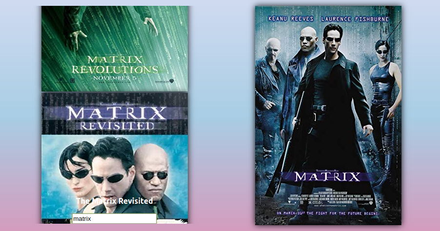

## Movie Listing

This project fetches movie details from The Open Movie database API.

### Features
* User can see a list of movies
* User can search for a list of movies by entering movie title
* User can click on the poster of the movie to see full details on right hand side

### Technologies
* React
* Jest, Enzyme 

### Web Application
